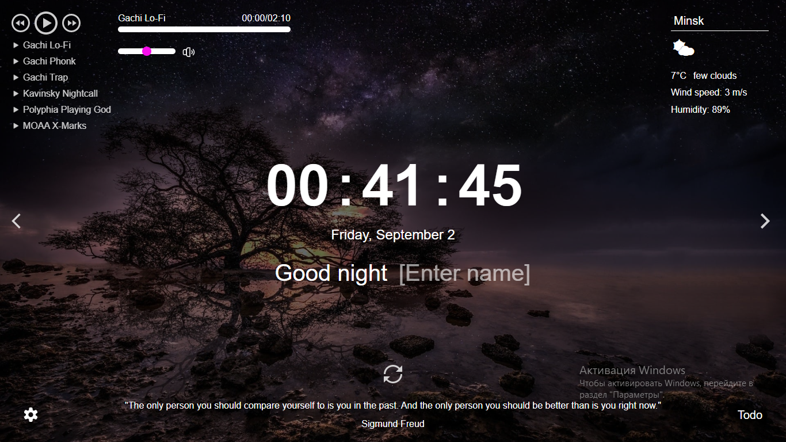

# Dzmitry Kaptsiuh

## Contacts

- Łódź, Poland
- +48 571 209 966
- dimaberry1@gmail.com
- telegram: @Pussygate
- discord: Dmitriy(@Kaptsiuh)

## Summary

With a fervor for front-end development that spans two years, I take genuine delight in my work at the computer. I thrive on unraveling diverse challenges and delving into the realms of emerging technologies.

## Skills

- HTML, Pug
- CSS, SCSS, Tailwind
- JavaScript
- TypeScript
- React
- Next.js
- Redux, Zustand
- Git, GitHub
- OOP, SOLID, KISS, DRY, YAGNI
- AWS
- Webpack, Vite
- Agile (Scrum, Kanban)

## Code example

#### DESCRIPTION:

Johnny is a farmer and he annually holds a beet farmers convention "Drop the beet".

Every year he takes photos of farmers handshaking. Johnny knows that no two farmers handshake more than once. He also knows that some of the possible handshake combinations may not happen.

However, Johnny would like to know the minimal amount of people that participated this year just by counting all the handshakes.

Help Johnny by writing a function, that takes the amount of handshakes and returns the minimal amount of people needed to perform these handshakes (a pair of farmers handshake only once).

```js
<function getParticipants(handshakes){
    let man = 0;
    let hand = 0;
    for(let i = 0; hand < handshakes; i++) {
        man += 1;
        hand = hand + (man - 1);
    }
    return man;
}
```

## Experience

#### Project 'Momentum':

[](https://rolling-scopes-school.github.io/kaptsiuh-JSFEPRESCHOOL2022Q2/momentum/)

#### Project 'Travel':

[](https://rolling-scopes-school.github.io/kaptsiuh-JSFEPRESCHOOL2022Q2/travel/)

#### Project 'Online Store':

[](https://magenta-taffy-bbd959.netlify.app/)

#### Project 'Shelter':

[](https://earnest-cupcake-0f181e.netlify.app/index.html)

#### Project 'Online Zoo':

[](https://rolling-scopes-school.github.io/kaptsiuh-JSFE2022Q3/online-zoo/pages/main/)

#### Project 'Pazzle Gem':

[](https://rolling-scopes-school.github.io/kaptsiuh-JSFE2022Q3/puzzle-gem/)

#### Project 'Music Lover':

[](https://rolling-scopes-school.github.io/kaptsiuh-JSFE2022Q3/songbird/pages/start/)

## Education

- Belarusian State University of Food and Chemical Technologies 2015-2020. "Technology of Fermentation and Winemaking"

## Courses:

- JS/FE Pre-School 2022 [Certificate](https://app.rs.school/certificate/6zof8i50)
- JavaScript/Front-end 2022 [Certificate](https://app.rs.school/certificate/ad6yi6ml)
- AWS Fundamentals 2023 [Certificate](https://app.rs.school/certificate/rgpaiu08)

## Languages

- English (B1 Intermediate)
- Ryssian (C2 native)
- Belarusian (C2 native)
- Poland (A2 Pre-Intermediate)
